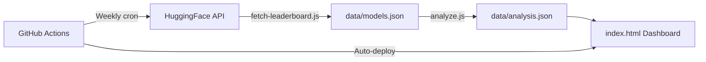

# LLM Pulse

Weekly intelligence brief on open-weight LLM performance and trends. Tracks 16 production-relevant models across 6 benchmark categories, generates structured analysis, and publishes a shareable dashboard.

**Live dashboard:** deployed via GitHub Pages

## Architecture



## How It Works

1. **Data Collection** — `scripts/fetch-leaderboard.js` queries the HuggingFace API for model metadata (downloads, likes, tags) from the [Open LLM Leaderboard](https://huggingface.co/spaces/open-llm-leaderboard/open_llm_leaderboard)
2. **Analysis** — `scripts/analyze.js` sends collected data to GitHub Models (GPT-4o-mini) to produce a structured weekly brief: highlights, tiered rankings, trend analysis, watchlist, and a social thread
3. **Dashboard** — `index.html` renders everything as a responsive single-page app with model cards, tier chips, and impact-coded highlights
4. **Automation** — GitHub Actions runs every Sunday at 12:00 UTC, commits updated data, and deploys to Pages

## Models Tracked

Meta Llama 3.x, Qwen 2.5, DeepSeek V3/R1, Microsoft Phi-4, Google Gemma 2, Mistral Large/Small, NVIDIA Nemotron, Cohere Command R+, Yi 1.5

## Benchmarks

MMLU, GPQA, MATH, IFEval, BBH, MUSR

## Project Structure

```
├── index.html                   # Dashboard (vanilla HTML/CSS/JS)
├── data/
│   ├── models.json              # Raw model metadata from HuggingFace
│   └── analysis.json            # Generated weekly brief
├── scripts/
│   ├── fetch-leaderboard.js     # HuggingFace API data collector
│   └── analyze.js               # GitHub Models analysis generator
└── package.json
```

## Local Development

```bash
node scripts/fetch-leaderboard.js                    # fetch model data
GITHUB_TOKEN=ghp_xxx node scripts/analyze.js         # generate analysis
open index.html                                       # view dashboard
```

## Tech Stack

| Layer | Tool |
|-------|------|
| Data source | HuggingFace API (no key required) |
| Analysis | GitHub Models API (GPT-4o-mini via `GITHUB_TOKEN`) |
| Frontend | Vanilla HTML/CSS/JS — no build step, no dependencies |
| Deployment | GitHub Pages via Actions |
| Template | [product-kit-template](https://github.com/1712n/product-kit-template) |
